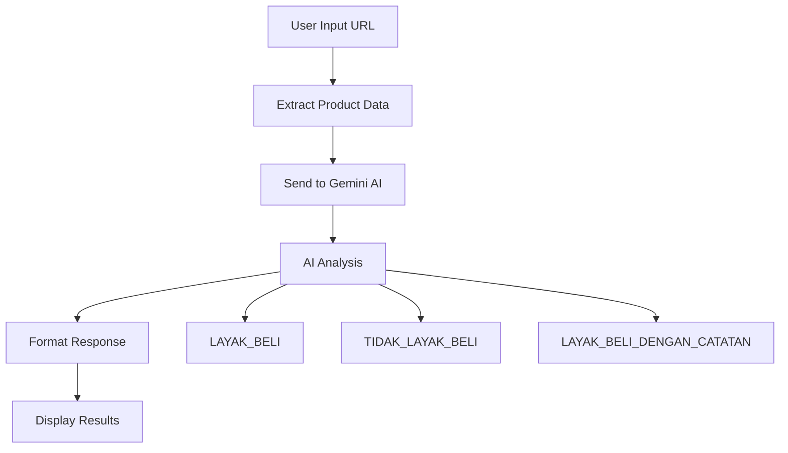

# 🤖 AI Shopping Consultant - Tutorial Lengkap

## 📋 Deskripsi
AI Shopping Consultant adalah sistem yang menganalisis produk Tokopedia menggunakan kecerdasan buatan (Gemini AI) untuk memberikan rekomendasi pembelian yang objektif dan terstruktur.

## 🎯 Fitur Utama
- **Ekstraksi Data Produk**: Harga, rating, jumlah rating, terjual, info toko, dll.
- **Analisis AI dengan Gemini**: Rekomendasi cerdas berdasarkan data produk
- **3 Kategori Rekomendasi**:
  - ✅ **LAYAK_BELI**: Produk berkualitas tinggi, direkomendasikan
  - ❌ **TIDAK_LAYAK_BELI**: Produk tidak direkomendasikan
  - ⚠️ **LAYAK_BELI_DENGAN_CATATAN**: Perlu pertimbangan khusus
- **Interface Web**: Frontend yang user-friendly
- **Analisis Budget**: Kesesuaian produk dengan budget pengguna

## 🏗️ Arsitektur Sistem

```
📁 Scraping-Tokopedia/
├── 📄 .env                          # Environment variables
├── 📄 requirements.txt              # Dependencies utama
├── 📄 requirements_ai.txt           # Dependencies AI
├── 📄 ai_consultant_api.py          # AI Consultant API
├── 📄 tokopedia_scraper_api.py      # Main Scraper API
├── 📄 tokopedia_scraper_improved.py # Core scraper
└── 📁 frontend/                     # Frontend files
    ├── 📄 index.html               # Main page
    ├── 📁 css/
    │   └── 📄 style.css            # Styling
    └── 📁 js/
        └── 📄 main.js              # JavaScript logic
```

## 🚀 Setup dan Instalasi

### 1. Setup Environment Variables
Buat file `.env` dengan konfigurasi berikut:
```env
# Gemini AI Configuration
GEMINI_API_KEY=your_gemini_api_key_here

# Setup Instructions:
# 1. Dapatkan API key dari: https://makersuite.google.com/app/apikey
# 2. Ganti 'your_gemini_api_key_here' dengan API key Anda
# 3. Pastikan tidak ada spasi di sekitar tanda =
```

### 2. Install Dependencies
```bash
# Install dependencies utama
pip install -r requirements.txt

# Install dependencies AI
pip install -r requirements_ai.txt
```

### 3. Mendapatkan Gemini API Key
1. Kunjungi [Google AI Studio](https://makersuite.google.com/app/apikey)
2. Login dengan akun Google
3. Klik "Create API Key"
4. Copy API key dan masukkan ke file `.env`

## 🎮 Cara Menjalankan

### 1. Jalankan Main Scraper API (Port 8000)
```bash
python tokopedia_scraper_api.py
```

### 2. Jalankan AI Consultant API (Port 8001)
```bash
python ai_consultant_api.py
```

### 3. Buka Frontend
Buka file `frontend/index.html` di browser atau gunakan live server.

## 📊 Flow Analisis



## 🔍 Contoh Penggunaan

### Input
```
URL: https://www.tokopedia.com/product-example
Budget: Rp 1,000,000 (opsional)
Preferensi: Brand terkenal, garansi resmi (opsional)
```

### Output
```json
{
  "recommendation": "LAYAK_BELI",
  "confidence_score": 0.85,
  "analysis": "Produk memiliki rating tinggi dengan banyak ulasan positif...",
  "pros": ["Rating tinggi (4.8/5)", "Banyak terjual", "Toko terpercaya"],
  "cons": ["Harga sedikit di atas rata-rata"],
  "key_insights": ["Produk populer di kategori ini", "Garansi resmi tersedia"],
  "budget_analysis": "Sesuai dengan budget yang ditetapkan"
}
```

## 🛠️ Konfigurasi API

### Main Scraper API (Port 8000)
- **Endpoint**: `/product-details`
- **Method**: POST
- **Body**: `{"url": "tokopedia_url"}`

### AI Consultant API (Port 8001)
- **Endpoint**: `/ai-consultant`
- **Method**: POST
- **Body**: Data produk + preferensi user

## 📝 Kriteria Rekomendasi AI

### ✅ LAYAK_BELI
- Rating > 4.5/5
- Banyak ulasan positif (>100)
- Toko terpercaya
- Harga wajar untuk kategori
- History penjualan bagus

### ❌ TIDAK_LAYAK_BELI
- Rating < 4.0/5
- Sedikit/tanpa ulasan
- Toko tidak terpercaya
- Harga tidak wajar
- Red flags lainnya

### ⚠️ LAYAK_BELI_DENGAN_CATATAN
- Rating 4.0-4.5/5
- Perlu pertimbangan khusus
- Ada kelebihan dan kekurangan
- Sesuai untuk kebutuhan tertentu

## 🎨 Fitur Frontend

### Responsive Design
- Mobile-friendly
- Modern UI/UX
- Loading animations
- Error handling

### Interactive Elements
- Real-time URL validation
- Budget formatting
- Smooth scrolling
- Progressive loading

## 🔧 Troubleshooting

### API Connection Issues
```bash
# Check if APIs are running
curl http://localhost:8000/
curl http://localhost:8001/health
```

### Gemini API Issues
- Pastikan API key valid
- Check quota limits
- Verify internet connection

### Scraping Issues
- URL harus dari Tokopedia
- Pastikan produk masih tersedia
- Check for CAPTCHA/blocking

## 📈 Monitoring dan Logging

### Log Files
- API requests/responses
- Error tracking
- Performance metrics

### Health Checks
- `/health` endpoint untuk AI API
- Status monitoring
- Uptime tracking

## 🚀 Pengembangan Lanjutan

### Possible Enhancements
1. **Database Integration**: Simpan history analisis
2. **User Accounts**: Personal recommendations
3. **Price Tracking**: Monitor perubahan harga
4. **Comparison Tool**: Bandingkan multiple produk
5. **Mobile App**: React Native/Flutter
6. **Advanced AI**: Fine-tuned models

### Scaling Considerations
- Redis caching
- Load balancing
- Database optimization
- API rate limiting

## 📄 Lisensi
Project ini dibuat untuk keperluan edukasi dan development.

## 🤝 Kontribusi
Silakan berkontribusi dengan:
1. Fork repository
2. Create feature branch
3. Commit changes
4. Push to branch
5. Create Pull Request

## 📞 Support
Untuk pertanyaan dan dukungan, silakan buat issue di repository.

---

**Happy Shopping with AI! 🛒🤖**
